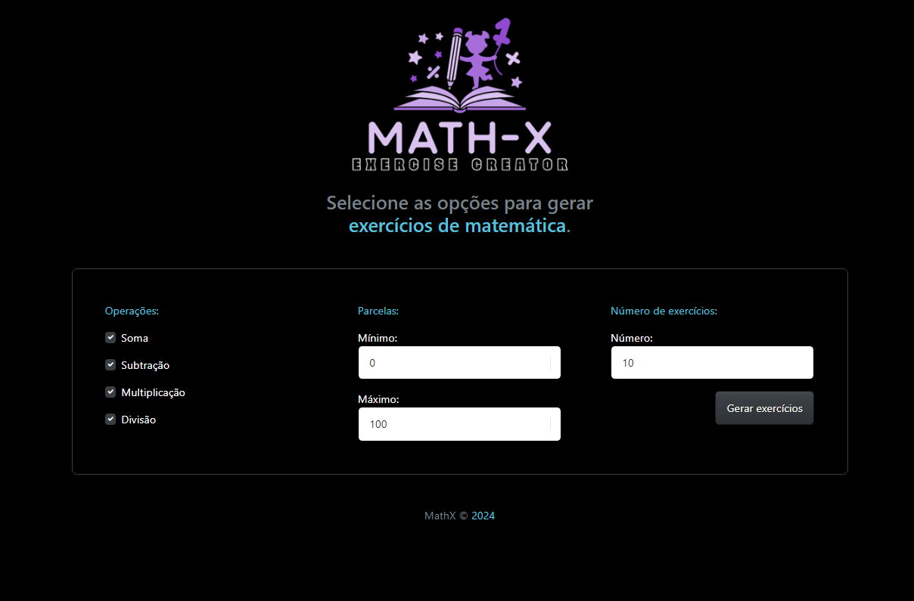

# Math-X

## Descrição

O **Math-X** é um gerador de exercicios exercícios de matemática com as 4 principais operações. Além de fornecer as respostas e permitir que o usuário faça download delas como arquivo txt. 

## Imagem do Projeto 📸



## Pré-requisitos

Antes de começar, certifique-se de ter os seguintes pré-requisitos instalados em sua máquina:

- **PHP** (versão 7.4 ou superior) - [Download PHP](https://www.php.net/downloads) Esse projeto foi feito utilizando a versão 8.2.24

- **Composer** (para gerenciar dependências do PHP) - [Download Composer](https://getcomposer.org/download/)  Não há necessidade de nenhuma alteração na configuração padrão 

- **Laragon** (para ambiente local) - [Download Laragon](https://laragon.org/download/) Não há necessidade de nenhuma alteração na configuração padrão 


## Instalação

Siga os passos abaixo para configurar o projeto em sua máquina local:

1. **Clone o repositório**

   - Abra o terminal e execute:
     ```bash
     git clone https://github.com/Gugaluis/Notes-Laravel.git
     cd notes
     ```

2. **Instale as dependências com Composer**

   - Execute o seguinte comando na pasta do projeto:
     ```bash
     composer install
     ```
          
3. **Configuração do Ambiente**

   - Renomeie o arquivo `.env.example` para `.env`:
     ```bash
     cp .env.example .env
     ```
   - Abra o arquivo `.env` e configure as informações da sessão, como:
     ```env
     APP_NAME=Math-X
     APP_ENV=local
     SESSION_DRIVER=file
     ```
     
4. **Gere a chave de aplicativo**

   - Execute o comando a seguir para gerar uma chave única para o aplicativo:
     ```bash
     php artisan key:generate
     ```
     
5. **Inicie o servidor**

   - Você pode iniciar o servidor integrado do Laravel com o seguinte comando:
     ```bash
     php artisan serve
     ```
   - O aplicativo estará disponível em `http://localhost:8000`.

## Utilização

1. **Acessando o Aplicativo**

  - Abra o navegador e vá para `http://localhost:8000`.

2. **Escolhendo Valores e Operações**

  - Escolha o valor minimo dos números que devem aparecer nas operações ( O menor número permitido é 0 )
  - Escolha o valor máximo dos números que devem aparecer nas operações ( O maior número permitido é 999 )
  - Escolha ao menos 1 ( uma ) operação dentre as 4 disponiveis
  - Escolha quantos exercicios deseja gerar 

## Contribuição

Se você deseja contribuir para o projeto, sinta-se à vontade para abrir uma issue ou enviar um pull request.
